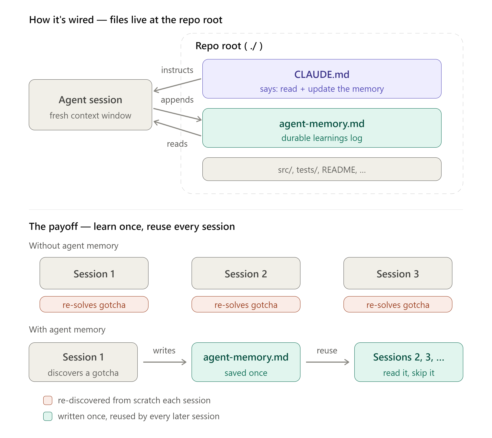

# simple-agent-memory

A repo-level memory pattern for AI coding agents. Learnings survive across
fresh agent sessions instead of being re-discovered from scratch every time.

## The problem

Every new agent session starts with a blank context. Environment quirks,
non-obvious build invocations, root causes of resolved bugs, and dead ends
all get re-learned — or worse, re-broken — session after session, unless
something persists them.

## The pattern

Two files, working together:

1. **`agent-memory.md`** at the repo root — a curated, git-tracked log of
   durable learnings (setup quirks, resolved bug root causes, dead ends,
   repo conventions not enforced by code).
2. **A block in `CLAUDE.md`** (or `AGENTS.md`) instructing agents to *read*
   `agent-memory.md` at the start of non-trivial work and when stuck, and to
   *append* to it when they learn something durable.

`CLAUDE.md`/`AGENTS.md` holds the always-loaded behavior (when to read and
write); `agent-memory.md` holds the accumulated content, read on demand — so
the memory log can grow without growing every session's baseline context
cost.



## Install (Claude Code plugin)

```
/plugin marketplace add brianschroeder/simple-agent-memory
/plugin install simple-agent-memory
```

Then, in any repo, ask Claude Code to set up agent memory (e.g. "set up
agent memory for this repo") and the skill will:
- create `agent-memory.md` at the repo root, if it doesn't already exist
- append the instruction block to `CLAUDE.md` (or `AGENTS.md`), if it isn't
  already there

Both steps are non-destructive — existing content is never overwritten.

## Manual install (no Claude Code plugins)

If you're not using Claude Code plugins, just copy the two files by hand:

1. Copy [`skills/agent-memory/assets/agent-memory.template.md`](skills/agent-memory/assets/agent-memory.template.md)
   to `agent-memory.md` at your repo root.
2. Copy the block from
   [`skills/agent-memory/assets/claude-md-block.md`](skills/agent-memory/assets/claude-md-block.md)
   into your `CLAUDE.md` or `AGENTS.md`.

Works with any agent that reads `CLAUDE.md`/`AGENTS.md` at session start —
not Claude Code-specific.

## Why on-demand, not `@import`

Don't switch to importing `agent-memory.md` (e.g. `@agent-memory.md`) into
`CLAUDE.md` unless the log is small and always relevant. Imports load the
whole file into context at every session start, so the baseline cost grows
as the log grows. Reading it on demand — at task start and when stuck —
keeps sessions lean and only pays the cost when the memory is actually
needed.

## License

MIT — see [LICENSE](LICENSE).
